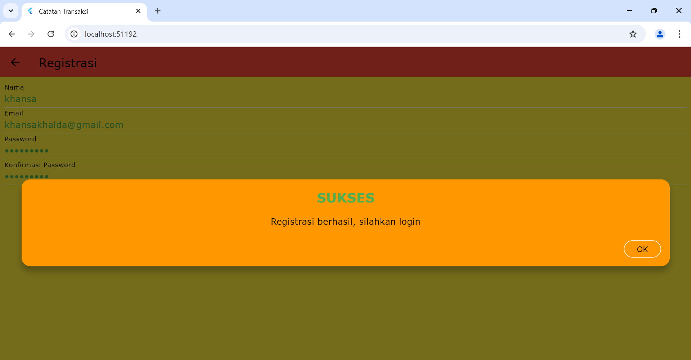
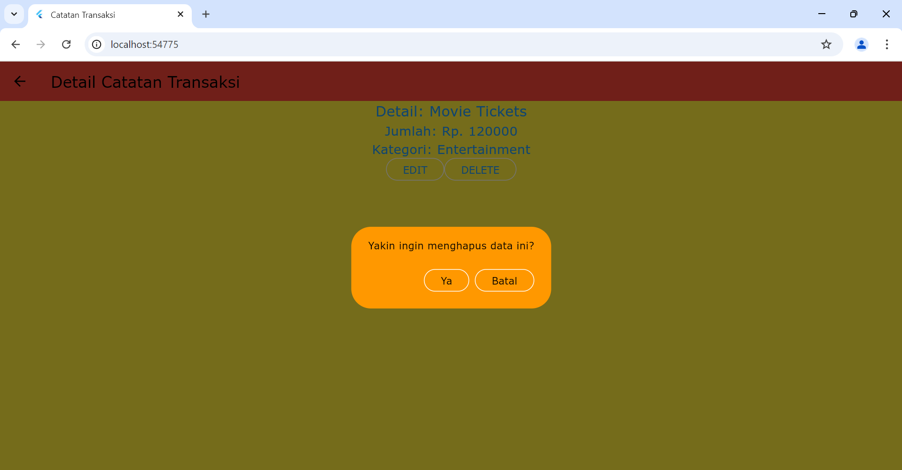

# Alur Aplikasi Manajemen Keuangan

# Tabel Catatan Transaksi

**A. Proses Registrasi**

Proses registrasi adalah langkah pertama bagi pengguna untuk membuat akun di aplikasi. Pengguna diharuskan mengisi formulir pendaftaran dengan data pribadi mereka.

1. **Input Data untuk Registrasi**

Penjelasan:

Pengguna diminta untuk mengisi beberapa informasi berikut:
• Nama: Nama lengkap pengguna.
• Email: Alamat email yang valid, yang akan digunakan untuk verifikasi dan sebagai identitas pengguna.
• Password: Kata sandi untuk akun yang harus diisi minimal dengan 3 karakter.
• Konfirmasi Password: Pengguna harus memasukkan ulang kata sandi untuk memastikan bahwa tidak ada kesalahan pengetikan.
Setelah semua informasi terisi, pengguna dapat mengklik tombol Registrasi untuk mengirimkan data.

Kode:

import 'package:flutter/material.dart';

class RegistrasiPage extends StatefulWidget {
const RegistrasiPage({Key? key}) : super(key: key);

@override
\_RegistrasiPageState createState() => \_RegistrasiPageState();
}

class \_RegistrasiPageState extends State<RegistrasiPage> {
final \_formKey = GlobalKey<FormState>();
final \_namaController = TextEditingController();
final \_emailController = TextEditingController();
final \_passwordController = TextEditingController();
final \_konfirmasiPasswordController = TextEditingController();

@override
Widget build(BuildContext context) {
return Scaffold(
appBar: AppBar(title: const Text("Registrasi")),
body: SingleChildScrollView(
padding: const EdgeInsets.all(8.0),
child: Form(
key: \_formKey,
child: Column(
children: [
_textField("Nama", _namaController),
_textField("Email", _emailController),
_textField("Password", _passwordController, isObscure: true),
_textField("Konfirmasi Password", _konfirmasiPasswordController, isObscure: true),
_registrasiButton(),
],
),
),
),
);
}

Widget \_textField(String label, TextEditingController controller, {bool isObscure = false}) {
return TextFormField(
decoration: InputDecoration(labelText: label),
controller: controller,
obscureText: isObscure,
validator: (value) => value!.isEmpty ? "$label harus diisi" : null,
);
}

Widget \_registrasiButton() {
return ElevatedButton(
child: const Text("Registrasi"),
onPressed: () {
if (\_formKey.currentState!.validate()) {
// Lakukan registrasi
}
},
);
}
}

2. **Pop-up Berhasil Registrasi**

Penjelasan:

Setelah pengguna berhasil mengisi data registrasi dan mengklik tombol registrasi, aplikasi akan menampilkan pop-up sebagai konfirmasi bahwa registrasi telah berhasil. Pop-up ini berisi pesan "Registrasi berhasil, silahkan login" dan memiliki warna latar belakang oranye serta teks berwarna hijau untuk menarik perhatian pengguna. Tombol "OK" digunakan untuk menutup pop-up tersebut.

Kode:

import 'package:flutter/material.dart';

class SuccessDialog extends StatelessWidget {
final String? description;
final VoidCallback? okClick;

const SuccessDialog({Key? key, this.description, this.okClick}) : super(key: key);

@override
Widget build(BuildContext context) {
return Dialog(
shape: RoundedRectangleBorder(
borderRadius: BorderRadius.circular(12.0),
),
elevation: 0.0,
backgroundColor: Colors.transparent,
child: dialogContent(context),
);
}

dialogContent(BuildContext context) {
return Container(
padding: const EdgeInsets.all(16.0),
decoration: BoxDecoration(
color: Colors.orange, // Background warna oranye
borderRadius: BorderRadius.circular(12.0),
),
child: Column(
mainAxisSize: MainAxisSize.min,
children: [
const Text(
"SUKSES",
style: TextStyle(fontSize: 24.0, fontWeight: FontWeight.w700, color: Colors.green),
),
const SizedBox(height: 16.0),
Text(
description ?? "",
textAlign: TextAlign.center,
style: const TextStyle(fontSize: 16.0, color: Colors.black), // Mengubah warna teks menjadi hitam
),
const SizedBox(height: 24.0),
Align(
alignment: Alignment.bottomRight,
child: OutlinedButton(
onPressed: () {
Navigator.of(context).pop(); // Menutup pop-up
if (okClick != null) okClick!(); // Menjalankan callback jika ada
},
child: const Text("OK"),
),
)
],
),
);
}
}

**B. Proses Login**

1. **Input Data untuk Login**

Penjelasan:

Pada tampilan ini, pengguna diminta untuk memasukkan email dan password yang telah didaftarkan sebelumnya. Setelah mengisi data tersebut, pengguna dapat menekan tombol "Login" untuk melanjutkan ke halaman utama aplikasi. Jika data yang dimasukkan valid, aplikasi akan memproses login dan mengarahkan pengguna ke halaman berikutnya.

Kode:

import 'package:flutter/material.dart';
import '../bloc/login_bloc.dart';
import '../helpers/user_info.dart';
import '../widget/warning_dialog.dart';
import '/ui/catatan_transaksi_page.dart';
import '/ui/registrasi_page.dart';

class LoginPage extends StatefulWidget {
const LoginPage({Key? key}) : super(key: key);

@override
\_LoginPageState createState() => \_LoginPageState();
}

class \_LoginPageState extends State<LoginPage> {
final \_formKey = GlobalKey<FormState>();
bool \_isLoading = false;
final \_emailTextboxController = TextEditingController();
final \_passwordTextboxController = TextEditingController();

@override
Widget build(BuildContext context) {
return Scaffold(
appBar: AppBar(
title: const Text('Login'),
),
body: SingleChildScrollView(
child: Padding(
padding: const EdgeInsets.all(8.0),
child: Form(
key: \_formKey,
child: Column(
children: [
_emailTextField(),
_passwordTextField(),
_buttonLogin(),
const SizedBox(height: 30),
_menuRegistrasi(),
],
),
),
),
),
);
}

// Membuat Textbox email
Widget \_emailTextField() {
return TextFormField(
decoration: const InputDecoration(labelText: "Email"),
keyboardType: TextInputType.emailAddress,
controller: \_emailTextboxController,
validator: (value) {
if (value!.isEmpty) {
return 'Email harus diisi';
}
return null;
},
);
}

// Membuat Textbox password
Widget \_passwordTextField() {
return TextFormField(
decoration: const InputDecoration(labelText: "Password"),
keyboardType: TextInputType.text,
obscureText: true,
controller: \_passwordTextboxController,
validator: (value) {
if (value!.isEmpty) {
return "Password harus diisi";
}
return null;
},
);
}

// Membuat Tombol Login
Widget \_buttonLogin() {
return ElevatedButton(
child: const Text("Login"),
style: ElevatedButton.styleFrom(
primary: Colors.red,
),
onPressed: () {
var validate = \_formKey.currentState!.validate();
if (validate) {
if (!\_isLoading) \_submit();
}
},
);
}

void \_submit() {
\_formKey.currentState!.save();
setState(() {
\_isLoading = true;
});
LoginBloc.login(
email: \_emailTextboxController.text,
password: \_passwordTextboxController.text,
).then((value) async {
if (value.code == 200) {
await UserInfo().setToken(value.token!);
await UserInfo().setUserID(value.userID!);
Navigator.pushReplacement(
context,
MaterialPageRoute(builder: (context) => const CatatanTransaksiPage()),
);
} else {
showDialog(
context: context,
barrierDismissible: false,
builder: (BuildContext context) => const WarningDialog(
description: "Login gagal, silahkan coba lagi",
),
);
}
}, onError: (error) {
showDialog(
context: context,
barrierDismissible: false,
builder: (BuildContext context) => const WarningDialog(
description: "Login gagal, silahkan coba lagi",
),
);
});
setState(() {
\_isLoading = false;
});
}

// Membuat menu untuk membuka halaman registrasi
Widget \_menuRegistrasi() {
return Center(
child: InkWell(
child: const Text(
"Registrasi",
style: TextStyle(color: Colors.blue),
),
onTap: () {
Navigator.push(
context,
MaterialPageRoute(builder: (context) => const RegistrasiPage()),
);
},
),
);
}
}

2. **Pop-up Gagal Login**

Penjelasan:

Pada tampilan ini, setelah pengguna mencoba melakukan login dengan data yang tidak valid, sebuah pop-up muncul untuk memberi tahu pengguna bahwa proses login telah gagal. Pesan di dalam pop-up menyarankan pengguna untuk mencoba kembali. Hal ini bertujuan untuk memberikan umpan balik yang jelas dan langsung agar pengguna dapat memperbaiki kesalahan yang mungkin terjadi.

Kode:

import 'package:flutter/material.dart';

class WarningDialog extends StatelessWidget {
final String? description;
final VoidCallback? okClick;

const WarningDialog({Key? key, this.description, this.okClick})
: super(key: key);

@override
Widget build(BuildContext context) {
return Dialog(
shape: RoundedRectangleBorder(
borderRadius: BorderRadius.circular(12.0)),
elevation: 0.0,
backgroundColor: Colors.transparent,
child: dialogContent(context),
);
}

dialogContent(BuildContext context) {
return Container(
padding: const EdgeInsets.all(16.0),
margin: const EdgeInsets.only(top: 12.0),
decoration: BoxDecoration(
color: Colors.orange, // Ubah warna background menjadi orange
shape: BoxShape.rectangle,
borderRadius: BorderRadius.circular(12.0),
boxShadow: const [
BoxShadow(
color: Colors.black26,
blurRadius: 10.0,
offset: Offset(0.0, 10.0),
),
],
),
child: Column(
mainAxisSize: MainAxisSize.min,
children: [
const Text(
"GAGAL",
style: TextStyle(
fontSize: 24.0,
fontWeight: FontWeight.w700,
color: Colors.black), // Mengubah warna teks menjadi hitam
),
const SizedBox(height: 16.0),
Text(
description!,
textAlign: TextAlign.center,
style: const TextStyle(
fontSize: 16.0,
color: Colors.black, // Mengubah warna teks menjadi hitam
),
),
const SizedBox(height: 24.0),
Align(
alignment: Alignment.bottomRight,
child: ElevatedButton(
onPressed: () {
Navigator.of(context).pop(); // Menutup dialog
},
child: const Text("OK"),
),
)
],
),
);
}
}

3. **Berhasil Login**

Penjelasan:

Tampilan ini menunjukkan bahwa pengguna berhasil melakukan login. Setelah login, pengguna diarahkan ke halaman utama aplikasi, di mana mereka dapat melihat daftar catatan transaksi yang telah mereka buat sebelumnya. Di sini, catatan transaksi yang ditampilkan adalah "Tuition Payment" dengan jumlah 1,500,000 yang tergolong dalam kategori "Education". Hal ini menunjukkan bahwa sistem berhasil memverifikasi kredensial pengguna dan memuat data terkait yang relevan.

Kode:

import 'package:flutter/material.dart';

class CatatanTransaksiPage extends StatelessWidget {
const CatatanTransaksiPage({Key? key}) : super(key: key);

@override
Widget build(BuildContext context) {
return Scaffold(
appBar: AppBar(
title: const Text('Daftar Catatan Transaksi'),
),
body: ListView(
padding: const EdgeInsets.all(8.0),
children: [
Card(
color: Colors.green, // Mengatur warna latar belakang kartu
child: ListTile(
title: const Text("Tuition Payment"),
subtitle: const Text("1500000 - Education"),
),
),
// Tambahkan widget lainnya sesuai kebutuhan
],
),
floatingActionButton: FloatingActionButton(
onPressed: () {
// Navigasi ke halaman tambah catatan transaksi
},
child: const Icon(Icons.add),
),
);
}
}

**C. Proses Tambah Catatan Transaksi**

1. **Input Catatan Transaksi Baru**

Penjelasan:

Tampilan ini menunjukkan proses penambahan catatan transaksi baru dalam aplikasi. Pengguna dapat memasukkan detail transaksi, jumlah, dan kategori sebelum menyimpan data tersebut. Setelah formulir diisi dan tombol "SIMPAN" diklik, data akan dikirim ke server untuk disimpan. Pengguna juga akan diarahkan kembali ke halaman sebelumnya setelah proses penyimpanan berhasil.

Kode:

import 'package:flutter/material.dart';
import '../bloc/catatan_transaksi_bloc.dart';

class CatatanTransaksiForm extends StatefulWidget {
const CatatanTransaksiForm({Key? key}) : super(key: key);

@override
\_CatatanTransaksiFormState createState() => \_CatatanTransaksiFormState();
}

class \_CatatanTransaksiFormState extends State<CatatanTransaksiForm> {
final \_formKey = GlobalKey<FormState>();
final \_detailController = TextEditingController();
final \_amountController = TextEditingController();
String \_category = 'Health';

@override
Widget build(BuildContext context) {
return Scaffold(
appBar: AppBar(
title: const Text('Tambah Transaksi'),
),
body: Padding(
padding: const EdgeInsets.all(16.0),
child: Form(
key: \_formKey,
child: Column(
children: [
TextFormField(
controller: \_detailController,
decoration: const InputDecoration(labelText: 'Detail Transaksi'),
validator: (value) {
if (value!.isEmpty) {
return 'Detail transaksi tidak boleh kosong';
}
return null;
},
),
TextFormField(
controller: \_amountController,
decoration: const InputDecoration(labelText: 'Jumlah'),
keyboardType: TextInputType.number,
validator: (value) {
if (value!.isEmpty) {
return 'Jumlah tidak boleh kosong';
}
return null;
},
),
DropdownButtonFormField<String>(
value: \_category,
items: <String>['Health', 'Entertainment', 'Education']
.map<DropdownMenuItem<String>>((String value) {
return DropdownMenuItem<String>(
value: value,
child: Text(value),
);
}).toList(),
onChanged: (String? newValue) {
setState(() {
\_category = newValue!;
});
},
decoration: const InputDecoration(labelText: 'Kategori'),
),
const SizedBox(height: 20),
ElevatedButton(
onPressed: () {
if (\_formKey.currentState!.validate()) {
\_submit();
}
},
child: const Text('SIMPAN'),
),
],
),
),
),
);
}

void _submit() {
CatatanTransaksiBloc.addCatatanTransaksi(
detail: \_detailController.text,
amount: double.parse(\_amountController.text),
category: \_category,
).then((_) {
Navigator.pop(context); // Kembali ke halaman sebelumnya
});
}
}

2. **Berhasil Tambah Catatan**

Penjelasan:

Tampilan ini menunjukkan bahwa pengguna berhasil menambahkan catatan transaksi baru setelah mengisi formulir. Di halaman ini, pengguna dapat melihat daftar catatan transaksi yang telah mereka buat. Setiap catatan menunjukkan detail transaksi, jumlah, dan kategori. Terdapat catatan transaksi baru yaitu "Gym Membership". Catatan transaksi ini menunjukkan bahwa sistem berhasil menyimpan data yang dimasukkan oleh pengguna.

Kode:

import 'package:flutter/material.dart';
import '../bloc/catatan_transaksi_bloc.dart';
import '../model/catatan_transaksi.dart';

class DaftarCatatanTransaksi extends StatefulWidget {
const DaftarCatatanTransaksi({Key? key}) : super(key: key);

@override
\_DaftarCatatanTransaksiState createState() => \_DaftarCatatanTransaksiState();
}

class \_DaftarCatatanTransaksiState extends State<DaftarCatatanTransaksi> {
late Future<List<CatatanTransaksi>> \_catatanList;

@override
void initState() {
super.initState();
\_catatanList = CatatanTransaksiBloc.getCatatanTransaksi();
}

@override
Widget build(BuildContext context) {
return Scaffold(
appBar: AppBar(
title: const Text('Daftar Catatan Transaksi'),
actions: [
IconButton(
icon: const Icon(Icons.add),
onPressed: () {
Navigator.pushNamed(context, '/tambahTransaksi');
},
),
],
),
body: FutureBuilder<List<CatatanTransaksi>>(
future: \_catatanList,
builder: (context, snapshot) {
if (snapshot.connectionState == ConnectionState.waiting) {
return const Center(child: CircularProgressIndicator());
} else if (snapshot.hasError) {
return Center(child: Text('Error: ${snapshot.error}'));
} else {
final catatanTransaksi = snapshot.data!;
return ListView.builder(
itemCount: catatanTransaksi.length,
itemBuilder: (context, index) {
final item = catatanTransaksi[index];
return Card(
child: ListTile(
title: Text(item.detail),
subtitle: Text('Rp. ${item.amount} - ${item.category}'),
tileColor: Colors.green,
),
);
},
);
}
},
),
);
}
}

**D. Proses Detail Catatan Transaksi**

1. **Melihat Detail Catatan**

Penjelasan:

Tampilan ini menunjukkan detail dari catatan transaksi yang telah dipilih oleh pengguna. Setelah pengguna memilih catatan dari daftar, aplikasi akan menampilkan informasi terperinci mengenai catatan tersebut, termasuk nama detail, jumlah, dan kategori. Di halaman ini, terdapat juga tombol untuk mengedit atau menghapus catatan tersebut. Hal ini memberikan fleksibilitas kepada pengguna untuk mengelola catatan transaksi mereka.

Kode:

import 'package:flutter/material.dart';
import '../bloc/catatan_transaksi_bloc.dart';
import '../model/catatan_transaksi.dart';
import '../ui/catatan_transaksi_form.dart';

class CatatanTransaksiDetail extends StatelessWidget {
final CatatanTransaksi catatanTransaksi;

const CatatanTransaksiDetail({Key? key, required this.catatanTransaksi}) : super(key: key);

@override
Widget build(BuildContext context) {
return Scaffold(
appBar: AppBar(
title: const Text('Detail Catatan Transaksi'),
),
body: Center(
child: Column(
mainAxisAlignment: MainAxisAlignment.center,
children: [
Text(
"Detail: ${catatanTransaksi.detail}",
style: const TextStyle(fontSize: 20.0),
),
Text(
"Jumlah: Rp. ${catatanTransaksi.amount}",
style: const TextStyle(fontSize: 18.0),
),
Text(
"Kategori: ${catatanTransaksi.category}",
style: const TextStyle(fontSize: 18.0),
),
_tombolHapusEdit(context)
],
),
),
);
}

Widget \_tombolHapusEdit(BuildContext context) {
return Row(
mainAxisAlignment: MainAxisAlignment.center,
children: [
OutlinedButton(
child: const Text("EDIT"),
onPressed: () {
Navigator.push(
context,
MaterialPageRoute(
builder: (context) => CatatanTransaksiForm(catatanTransaksi: catatanTransaksi),
),
);
},
),
const SizedBox(width: 10),
OutlinedButton(
child: const Text("DELETE"),
onPressed: () {
// Tindakan untuk menghapus catatan
CatatanTransaksiBloc.deleteCatatanTransaksi(id: catatanTransaksi.id!);
Navigator.pop(context);
},
),
],
);
}
}

**E. Proses Ubah Catatan Transaksi**

1. **Input Data untuk Ubah Catatan**

Penjelasan:

Tampilan ini menunjukkan halaman untuk mengubah catatan transaksi yang telah dibuat sebelumnya. Setelah pengguna memilih catatan yang ingin diubah, aplikasi akan menampilkan form yang sudah terisi dengan data catatan tersebut. Pengguna dapat melakukan modifikasi pada detail transaksi, jumlah, dan kategori. Setelah melakukan perubahan, pengguna dapat menekan tombol "UBAH" untuk menyimpan perubahan yang telah dilakukan. Hal ini memudahkan pengguna dalam mengelola dan memperbarui catatan transaksi mereka.

Kode:

import 'package:flutter/material.dart';
import '../bloc/catatan_transaksi_bloc.dart';
import '../model/catatan_transaksi.dart';

class CatatanTransaksiForm extends StatefulWidget {
final CatatanTransaksi? catatanTransaksi;

const CatatanTransaksiForm({Key? key, this.catatanTransaksi}) : super(key: key);

@override
\_CatatanTransaksiFormState createState() => \_CatatanTransaksiFormState();
}

class \_CatatanTransaksiFormState extends State<CatatanTransaksiForm> {
final \_formKey = GlobalKey<FormState>();
final \_detailController = TextEditingController();
final \_jumlahController = TextEditingController();
final \_kategoriController = TextEditingController();

@override
void initState() {
super.initState();
if (widget.catatanTransaksi != null) {
\_detailController.text = widget.catatanTransaksi!.detail;
\_jumlahController.text = widget.catatanTransaksi!.amount.toString();
\_kategoriController.text = widget.catatanTransaksi!.category;
}
}

@override
Widget build(BuildContext context) {
return Scaffold(
appBar: AppBar(
title: const Text('UBAH TRANSAKSI'),
),
body: Padding(
padding: const EdgeInsets.all(16.0),
child: Form(
key: \_formKey,
child: Column(
children: [
TextFormField(
controller: _detailController,
decoration: const InputDecoration(labelText: "Detail Transaksi"),
validator: (value) => value!.isEmpty ? 'Detail transaksi harus diisi' : null,
),
TextFormField(
controller: _jumlahController,
decoration: const InputDecoration(labelText: "Jumlah"),
keyboardType: TextInputType.number,
validator: (value) => value!.isEmpty ? 'Jumlah harus diisi' : null,
),
TextFormField(
controller: _kategoriController,
decoration: const InputDecoration(labelText: "Kategori"),
validator: (value) => value!.isEmpty ? 'Kategori harus diisi' : null,
),
ElevatedButton(
onPressed: () {
if (_formKey.currentState!.validate()) {
// Simpan data yang diubah
CatatanTransaksiBloc.updateCatatanTransaksi(
id: widget.catatanTransaksi!.id!,
detail: _detailController.text,
amount: double.parse(_jumlahController.text),
category: _kategoriController.text,
).then((value) {
Navigator.pop(context);
});
}
},
child: const Text("UBAH"),
),
],
),
),
),
);
}
}

2. **Berhasil Ubah Catatan Transaksi**

Penjelasan:

Tampilan ini menunjukkan bahwa pengguna berhasil memperbarui catatan transaksi. Setelah pengguna mengklik tombol "UBAH" dan menyimpan perubahan, aplikasi menampilkan daftar catatan transaksi yang telah diperbarui, di mana detail catatan transaksi berubah dari "Gym Membership" menjadi "Movie Tickets." Dalam hal ini, pengguna dapat melihat catatan transaksi dengan detail dan kategori yang telah diperbarui. Hal ini menunjukkan bahwa sistem berfungsi dengan baik dalam mengelola data transaksi.

Kode:

// Kode di dalam bloc untuk memperbarui catatan transaksi
class CatatanTransaksiBloc {
static Future<void> updateCatatanTransaksi({
required String id,
required String detail,
required double amount,
required String category,
}) async {
// Logika untuk mengupdate catatan transaksi di database
// Misalnya, menggunakan API untuk mengupdate data
await ApiService.updateTransaksi(id, detail, amount, category);
}
}

// Kode di dalam halaman daftar catatan transaksi untuk menampilkan data
class CatatanTransaksiPage extends StatefulWidget {
@override
\_CatatanTransaksiPageState createState() => \_CatatanTransaksiPageState();
}

class \_CatatanTransaksiPageState extends State<CatatanTransaksiPage> {
List<CatatanTransaksi> \_catatanTransaksiList = [];

@override
void initState() {
super.initState();
\_fetchCatatanTransaksi();
}

Future<void> \_fetchCatatanTransaksi() async {
// Logika untuk mengambil daftar catatan transaksi dari database
\_catatanTransaksiList = await CatatanTransaksiBloc.getCatatanTransaksi();
setState(() {});
}

@override
Widget build(BuildContext context) {
return Scaffold(
appBar: AppBar(
title: const Text('Daftar Catatan Transaksi'),
),
body: ListView.builder(
itemCount: \_catatanTransaksiList.length,
itemBuilder: (context, index) {
final catatan = \_catatanTransaksiList[index];
return ListTile(
title: Text(catatan.detail),
subtitle: Text('Rp. ${catatan.amount} - ${catatan.category}'),
onTap: () {
Navigator.push(
context,
MaterialPageRoute(
builder: (context) => CatatanTransaksiDetail(
catatanTransaksi: catatan,
),
),
);
},
);
},
),
floatingActionButton: FloatingActionButton(
onPressed: () {
Navigator.push(
context,
MaterialPageRoute(
builder: (context) => CatatanTransaksiForm(),
),
);
},
child: const Icon(Icons.add),
),
);
}
}

**F. Proses Hapus Catatan Transaksi**

1. **Konfirmasi Hapus Catatan Transaksi**

Penjelasan:

Tampilan ini menunjukkan proses konfirmasi penghapusan catatan transaksi. Ketika pengguna menekan tombol "DELETE," aplikasi akan menampilkan pesan konfirmasi yang menanyakan, "Yakin ingin menghapus data ini?" Pengguna diberikan dua pilihan: "Ya" untuk melanjutkan penghapusan dan "Batal" untuk membatalkan proses. Jika pengguna mengonfirmasi penghapusan, sistem akan menghapus catatan transaksi yang dipilih.

Kode:

void confirmHapus() {
AlertDialog alertDialog = AlertDialog(
backgroundColor: Colors.orange, // Mengubah warna background dialog
content: const Text(
"Yakin ingin menghapus data ini?",
style: TextStyle(color: Colors.black), // Mengubah warna teks menjadi hitam
),
actions: [
OutlinedButton(
child: const Text(
"Ya",
style: TextStyle(color: Colors.black), // Warna teks "Ya" menjadi hitam
),
onPressed: () {
CatatanTransaksiBloc.deleteCatatanTransaksi(
id: widget.catatanTransaksi!.id!).then(
(value) => {
Navigator.of(context).push(MaterialPageRoute(
builder: (context) => const CatatanTransaksiPage()))
},
onError: (error) {
showDialog(
context: context,
builder: (BuildContext context) => const WarningDialog(
description: "Hapus gagal, silahkan coba lagi",
));
});
},
),
OutlinedButton(
child: const Text(
"Batal",
style: TextStyle(color: Colors.black), // Warna teks "Batal" menjadi hitam
),
onPressed: () => Navigator.pop(context),
)
],
);

showDialog(builder: (context) => alertDialog, context: context);
}

2. **Berhasil Hapus Catatan Transaksi**

Penjelasan:

Tampilan ini menunjukkan bahwa pengguna berhasil menghapus catatan transaksi. Setelah mengonfirmasi penghapusan, aplikasi akan kembali ke halaman utama yang menampilkan daftar catatan transaksi. Dalam tampilan ini, catatan transaksi yang sebelumnya ada telah dihapus, dan pengguna hanya dapat melihat catatan yang tersisa. Hal ini menunjukkan bahwa sistem dapat mengelola dan memperbarui data transaksi dengan efektif.

Kode:

void confirmHapus() {
AlertDialog alertDialog = AlertDialog(
backgroundColor: Colors.orange,
content: const Text(
"Yakin ingin menghapus data ini?",
style: TextStyle(color: Colors.black),
),
actions: [
OutlinedButton(
child: const Text("Ya", style: TextStyle(color: Colors.black)),
onPressed: () {
CatatanTransaksiBloc.deleteCatatanTransaksi(
id: widget.catatanTransaksi!.id!).then((value) {
Navigator.of(context).pushReplacement(MaterialPageRoute(
builder: (context) => const CatatanTransaksiPage()));
}, onError: (error) {
showDialog(
context: context,
builder: (BuildContext context) => const WarningDialog(
description: "Hapus gagal, silahkan coba lagi",
));
});
},
),
OutlinedButton(
child: const Text("Batal", style: TextStyle(color: Colors.black)),
onPressed: () => Navigator.pop(context),
)
],
);

showDialog(builder: (context) => alertDialog, context: context);
}

**G. Proses Logout**

1. **Tombol Logout**

Penjelasan:

Tampilan ini menunjukkan pengguna yang berhasil melakukan logout dari aplikasi. Setelah menekan tombol "Logout," pengguna akan keluar dari sesi mereka dan diarahkan kembali ke halaman login. Ini memastikan bahwa sesi pengguna dikelola dengan baik, dan data pengguna tidak akan dapat diakses tanpa kredensial yang valid. Tombol logout memberikan akses mudah bagi pengguna untuk mengamankan akun mereka.

Kode:

// Fungsi untuk Logout
void logout() {
UserInfo().removeToken(); // Menghapus token dari penyimpanan
Navigator.pushReplacement(
context,
MaterialPageRoute(builder: (context) => const LoginPage()), // Kembali ke halaman login
);
}

// Tombol Logout di AppBar atau Drawer
IconButton(
icon: const Icon(Icons.logout),
onPressed: logout, // Memanggil fungsi logout saat ditekan
),

2. **Berhasil Logout**

Penjelasan:

Tampilan ini menunjukkan bahwa pengguna telah berhasil melakukan logout dari aplikasi. Setelah mengklik tombol "Logout," pengguna diarahkan kembali ke halaman login. Hal ini memastikan bahwa semua sesi pengguna diakhiri dengan baik, sehingga akun mereka aman dan tidak dapat diakses tanpa memasukkan kembali kredensial. Tampilan halaman login kembali memberikan kesempatan kepada pengguna untuk masuk dengan akun yang sama atau melakukan registrasi jika mereka belum memiliki akun.

Kode:

// Di dalam class LoginPage
@override
void initState() {
super.initState();
checkLoginStatus();
}

// Memeriksa status login pengguna
void checkLoginStatus() async {
var token = await UserInfo().getToken();
if (token == null) {
// Jika tidak ada token, arahkan ke halaman login
Navigator.pushReplacement(
context,
MaterialPageRoute(builder: (context) => const LoginPage()),
);
}
}

// Tombol Login
ElevatedButton(
child: const Text("Login"),
onPressed: () {
// Logika untuk login
},
),
